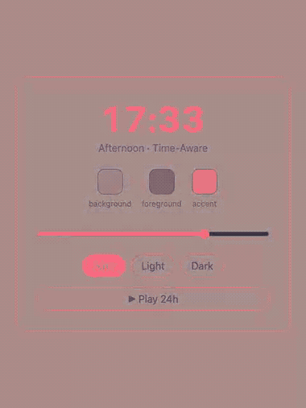

# @divypandya/time-aware-theme

[](https://github.com/divypandya/time-aware-theme/actions/workflows/ci.yml)
[](https://www.npmjs.com/package/@divypandya/time-aware-theme)


[](LICENSE.md)

A theme that shifts with the time of day: a pure resolver that maps a minute of
the day to interpolated [OKLCH](https://oklch.com/) tokens, a framework-free
DOM controller that applies them, a React adapter, and deterministic testing
utilities for simulating the clock.



Recording of [examples/vanilla-dom](examples/vanilla-dom): dragging the
time-of-day slider (or hitting **Play 24h**) calls the real
`createThemeController`, which writes the `--tat-*` custom properties you see
updating live — this isn't a mockup.

## Stats

|                                       |                                                                            |
| ------------------------------------- | -------------------------------------------------------------------------- |
| Runtime dependencies                  | **0**                                                                      |
| Core bundle (`dist/index.js`, gzip)   | ~4.0 KB, budget 4.5 KB                                                     |
| DOM bundle (`dist/dom.js`, gzip)      | ~2.8 KB, budget 3 KB                                                       |
| React adapter (`dist/react.js`, gzip) | ~0.4 KB, budget 1 KB                                                       |
| Resolver performance                  | median < 1 ms, p95 < 3 ms per resolve ([benchmark](scripts/benchmark.mjs)) |
| Node.js                               | `>=24 <27`                                                                 |

Bundle sizes are enforced in CI on every push via `npm run size`
([scripts/size-check.mjs](scripts/size-check.mjs)); resolver performance is
checked via `npm run bench` ([scripts/benchmark.mjs](scripts/benchmark.mjs)).

## Installation

```sh
npm install @divypandya/time-aware-theme
```

React is an optional peer dependency — install it only if you use the
`/react` entry point.

## Quick start

Define a theme system once: static light/dark fallbacks plus a series of
time-of-day stops. Tokens between stops are interpolated automatically.

```ts
import { defineThemeSystem } from '@divypandya/time-aware-theme';

const system = defineThemeSystem({
  name: 'app-theme',
  staticThemes: {
    light: {
      background: 'oklch(0.98 0.01 250 / 1)',
      foreground: 'oklch(0.17 0.03 250 / 1)'
    },
    dark: {
      background: 'oklch(0.13 0.02 250 / 1)',
      foreground: 'oklch(0.96 0.01 250 / 1)'
    }
  },
  stops: [
    {
      minute: 0,
      appearance: 'dark',
      phase: 'night',
      tokens: {
        background: 'oklch(0.14 0.02 260 / 1)',
        foreground: 'oklch(0.96 0.01 260 / 1)'
      }
    },
    {
      minute: 360,
      appearance: 'light',
      phase: 'dawn',
      tokens: {
        background: 'oklch(0.99 0.02 75 / 1)',
        foreground: 'oklch(0.10 0.03 75 / 1)'
      }
    },
    {
      minute: 1080,
      appearance: 'dark',
      phase: 'sunset',
      tokens: {
        background: 'oklch(0.22 0.04 250 / 1)',
        foreground: 'oklch(0.94 0.01 250 / 1)'
      }
    }
  ]
});
```

Create and start the DOM controller before mounting React so the first paint
already reflects the correct theme. The controller writes tokens as CSS custom
properties, toggles the `.dark` class, and updates `color-scheme`. It only
touches the DOM once you pass it `document`/`window` explicitly — without
them it stays inert (safe to construct during SSR).

```tsx
import { createRoot } from 'react-dom/client';
import { createThemeController } from '@divypandya/time-aware-theme/dom';
import { TimeAwareThemeProvider } from '@divypandya/time-aware-theme/react';

const controller = createThemeController({ system, document, window });
controller.start();

createRoot(document.getElementById('root')!).render(
  <TimeAwareThemeProvider controller={controller}>
    <App />
  </TimeAwareThemeProvider>
);
```

Read the resolved theme and switch modes from inside the tree:

```tsx
import { useTimeAwareTheme } from '@divypandya/time-aware-theme/react';

function ThemeToggle() {
  const { mode, appearance, phase, setMode } = useTimeAwareTheme();

  return (
    <button
      onClick={() => setMode(mode === 'time-aware' ? 'dark' : 'time-aware')}
    >
      {appearance} · {phase} ({mode})
    </button>
  );
}
```

Resolve a snapshot directly, without the DOM controller, for server-side
rendering or previews:

```ts
import { resolveThemeAt } from '@divypandya/time-aware-theme';

const snapshot = resolveThemeAt(system, 9 * 60); // 09:00
snapshot.appearance; // 'light'
snapshot.phase; // 'dawn'
snapshot.cssText; // '--background: oklch(...); --foreground: oklch(...);'
```

Test time-dependent behavior deterministically with the manual clock instead
of mocking `Date` and timers by hand:

```ts
import { createManualClock } from '@divypandya/time-aware-theme/testing';
import { createThemeController } from '@divypandya/time-aware-theme/dom';

const clock = createManualClock({ now: new Date('2026-08-12T06:00:00Z') });
const controller = createThemeController({ system, clock });

controller.start();
clock.advanceBy(60 * 60_000); // fast-forward one hour
controller.getSnapshot().phase;
```

## Examples

Runnable demo apps live under [examples/](examples), each with its own
README covering setup:

- [examples/vanilla-dom](examples/vanilla-dom) — zero-build, plain DOM +
  `createThemeController`, the source of the recording above.
- [examples/react](examples/react) — Vite + React app using
  `TimeAwareThemeProvider` / `useTimeAwareTheme`, consuming the package the
  same way a real installer would (`file:../..` dependency, not a relative
  `src` import).

## Entry points

- `@divypandya/time-aware-theme`
- `@divypandya/time-aware-theme/dom`
- `@divypandya/time-aware-theme/react`
- `@divypandya/time-aware-theme/testing`

## Public surface

- `defineThemeSystem`
- `resolveThemeAt`
- `resolveThemeSnapshot`
- `serializeOklch`
- `createThemeController`
- `TimeAwareThemeProvider`
- `useTimeAwareTheme`
- `createManualClock`

## Runtime notes

- No runtime dependencies.
- React is an optional peer for the adapter entry point.
- The DOM controller is safe to construct without `window` or `document`; it simply becomes inert.
- The controller writes resolved theme tokens as CSS custom properties, toggles the `.dark` class, and updates `color-scheme`.

## Non-goals

- No location access.
- No weather-based or network-driven theming.
- No user-defined schedules in v0.1.0.
- No React-driven minute ticking.
